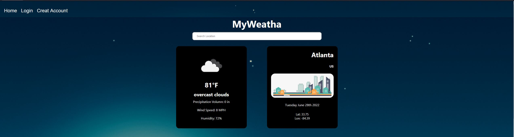

# MyWeatha



This project was bootstrapped with [Create React App](https://github.com/facebook/create-react-app).

## Table of Contents :books:
* [General Info :information_source:](#general-info)
* [Local Installation :open_file_folder:](#local-installation)
* [Project goals :trophy:](#project-goals)
* [Tools used :wrench:](#tools-used)
* [Try it Out! :sunny:](#try-it-out)


## General Info
`MyWeatha` is a full stack website that utilizes user authentication and authorization to display the weather forecast of any location seelcted by the user. The user can even set a location as their default weather forecast.

This is repository is the Client side of the website. The server side can be found [here](https://github.com/amimbs/react-weather-app-server.git).

## Local Installation
1) you will need to install the client and server repositories.
2) then you need node to install the project dependancies. 
3) Follow the steps below:
```console
$ cd your-desired-repo
$ git clone https://github.com/amimbs/react-weather-app-client.git
$ git clone https://github.com/amimbs/react-weather-app-server.git
$ cd react-weather-app-client
$ npm install
$ cd ..
$ cd react-weather-app-server
$ npm install
```
4) Next you you'll need 2 API keys from [OpenWeather](https://openweathermap.org/) to utilize in the following API calls:
    - [Current Weather Data](https://openweathermap.org/current)
    - [5 day weather forecast](https://openweathermap.org/forecast5)
4) Follow the instructions below:
    ```bash
    $ cd react-weather-app-client
    $ touch .env
    ```
5) In `.env`
```
REACT_APP_WEATHER_KEY = 'your api key'
REACT_APP_WEATHER_API_KEY = 'your api key'
```
6) from the client directory you can now run `npm start`
    - Runs the app in the development mode.\
    - Open [http://localhost:3000](http://localhost:3000) to view it in your browser.

    - The page will reload when you make changes.\
    - You may also see any lint errors in the console.
```console
$ npm start
```
7) If you want to utilize user authentication and authorization you will need to host a server PostgreSQl server.
    - I recommend [ElephantSQL](https://www.elephantsql.com/).
8) Enter the following commands in your console once you've created a database using your desire service. (The following steps will be for 'Elephant SQL', a 'PostgreSQL' server, and `Sequelize`)
```console
$ cd react-weather-app-server
$ touch .env
```
9) In `.env`
```
DB_HOST='your database host'
DB_USER='your database user`
DB_PASSWORD='your database password'
DB_DATABASE='your database user'
```
10) From your Server directory update sequelize and run a migration
```console
$ cd react-weather-app-server
$ npx sequelize-cli init
$ npx sequelize-cli db:migrate
```
- This will push your download migrations from `react-weather-app-server` to your database

11) Now you can run `nodemon` from your server directory so that any changes you make to your 'server.js' will restart and run instantly.
```console
$ cd react-weather-app-server
$ nodemon server.js
```
12) Switch to you in your `client folder`
```console
$ cd ..
$ cd react-weather-app-client
```
13) In `CurrentForecast.jsx`, `Login.jsx`, and `Register.jsx`, switch the axios routes to th elocalhost post routes from `routes/Users.js` and `server.js` in `react-weather-app-server`
14) Your application is now ready to be run locally!
15) Just a recap of how to do that from the project directory:
```console
$ cd react-weather-app-client
$ npm start
```
- from a second terminal
```console
$ cd react-weather-app-server
$ nodemon server.js
```

### Project goals
- :heavy_check_mark: Uses OpenWeather Api https://openweathermap.org/forecast5#JSON
- :heavy_check_mark: Fetch Data using [axios](https://www.npmjs.com/package/axios)
- :heavy_check_mark: 5 day forecast
- :heavy_check_mark: Implement [Toastify](https://www.npmjs.com/package/react-toastify) for imvalid searches
- :heavy_check_mark: divide each 3 hr incremenent of a day from the api into individual day divs
- :heavy_check_mark: style the cards for each 3hr increment with each parent day div using [Styled Components](https://www.npmjs.com/package/styled-components)
- :heavy_check_mark: display the correct days of the week
- :heavy_check_mark: optimize and styling
- :heavy_check_mark: create a user table
- :heavy_check_mark: add user registration forms using [formik](https://www.npmjs.com/package/formik) and [yup](https://www.npmjs.com/package/yup)
- :heavy_check_mark: add user authentication 
- :heavy_check_mark: add user authorization
- :heavy_check_mark: style the forms
- :heavy_check_mark: user can add a city as their default forecast
- :heavy_check_mark:add current weather hook
- :heavy_check_mark:switch https://www.weatherapi.com/ for current weathr hook
- :heavy_check_mark:select a better hook for the 5 day forecast (?)
- :heavy_check_mark:after consideration switched back to openweatherapi
- :heavy_check_mark:add JWT for user authorization
- :heavy_check_mark:how to create authorized protected routes only for the user?
- :heavy_check_mark:store favorites in the backend
- :heavy_check_mark:front end should store userid, store a city as default, reponse should have userid and default locaiton

## Tools Used
- React
- React Router Dom
- [Styled Components](https://www.npmjs.com/package/styled-components)
- [Toastify](https://www.npmjs.com/package/react-toastify)
- JavaScript
- [Moment](https://momentjs.com/)
- [Yup](https://www.npmjs.com/package/yup)
- [Formik](https://www.npmjs.com/package/formik)
- [Axios](https://www.npmjs.com/package/axios)
- [OpenWeather](https://openweathermap.org/)
- dotenv
- cors
- Express
- Sequelize
- [ElephantSQL](https://www.elephantsql.com/)
- [Nodemon](https://www.npmjs.com/package/nodemon)
- [Bcrypt](https://www.npmjs.com/package/bcrypt)

## Try it Out!
- [Website](https://myweatha.netlify.app/)

https://user-images.githubusercontent.com/85318939/176268607-e6c1065d-ebe1-4b82-ac51-c178c802f0ed.mp4


